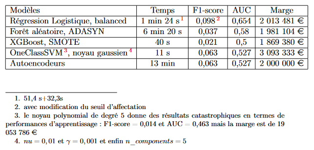
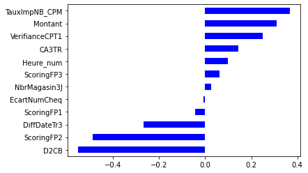

Projet conduit avec Christelle pour le cours de Fouille de données massives en 2022

# Détection des chèques impayés et faux chèques pour une enseigne de grande distribution

Les chèques impayés et les faux chèques génèrent une perte non négligeable pour les enseignes de la grande distribution. De façon à maitriser ces pertes, il semble intéressant d'exploiter les données massives disponibles afin d'essayer de détecter cette typologie de chèques. Dans le cadre de ce projet, différentes méthodes ont été utilisées afin de gérer le problème des classes déséquilibrées et différentes techniques d'apprentissage automatique ont été mises en oeuvre. La volumétrie a aussi été un des axes de travail sur les données. L'objectif de ce rapport est de rendre compte de l'ensemble de ces démarches ainsi que de comparer les résultats obtenus. 

## Protocole expérimental

## Résultats

On peut résumer l’ensemble des meilleurs résultats obtenus pour chaque
famille d’algorithme testée lors des différentes techniques d’apprentissage :

La regression logistique avec ajustement des poids et modification du seuil d'affectation est la meilleure en terme de F1-score et de critère AUC. De plus, pour les gestionnaires, elle présente l'avantage de pouvoir fournir une description interprétable dans la façon dont les variables influent sur la prise de décision. Cepandant, le One Class SVM et le XGBoost sont très intéréssants au niveau des temps de calcul, notamment dans le cadre des fouilles de données massives. De plus, ils ont des perspectives d'amélioration des performances.

## Variables influentes

