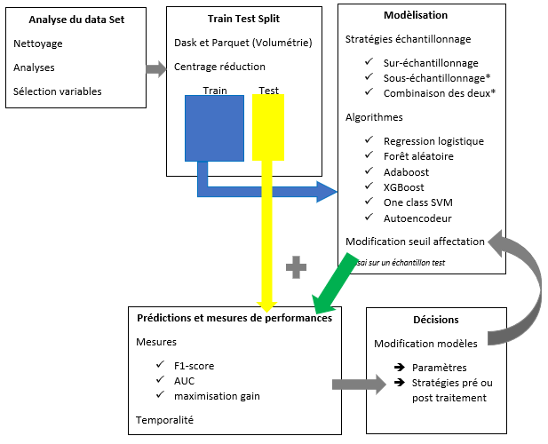

# Détection des chèques impayés et faux chèques pour une enseigne de grande distribution

{:style="display:block; margin-left:auto; margin-right:auto"}

Les chèques impayés et les faux chèques génèrent une perte non négligeable pour les enseignes de la grande distribution. De façon à maitriser ces pertes, il semble intéressant d'exploiter les données massives disponibles afin d'essayer de détecter cette typologie de chèques. Dans le cadre de ce projet, différentes méthodes ont été utilisées afin de gérer le problème des classes déséquilibrées et différentes techniques d'apprentissage automatique ont été mises en oeuvre. La volumétrie a aussi été un des axes de travail sur les données. L'objectif de ce rapport est de rendre compte de l'ensemble de ces démarches ainsi que de comparer les résultats obtenus. 

## Protocole

